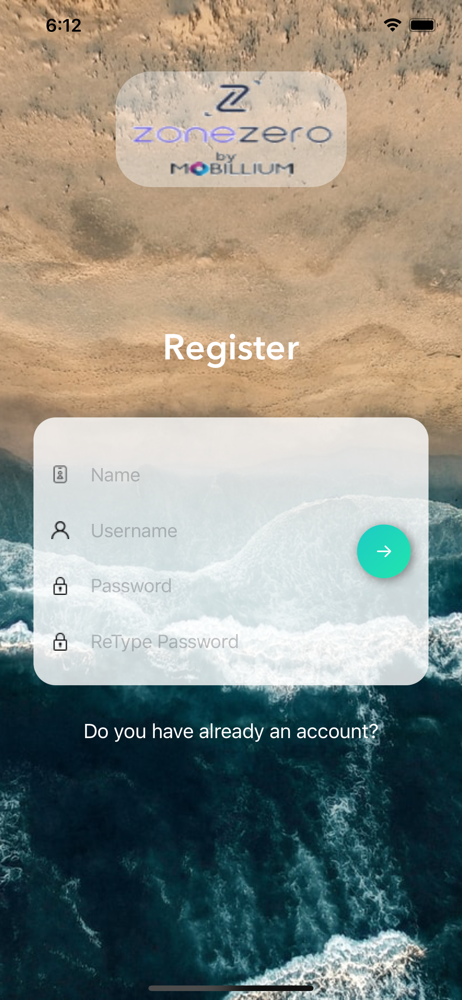
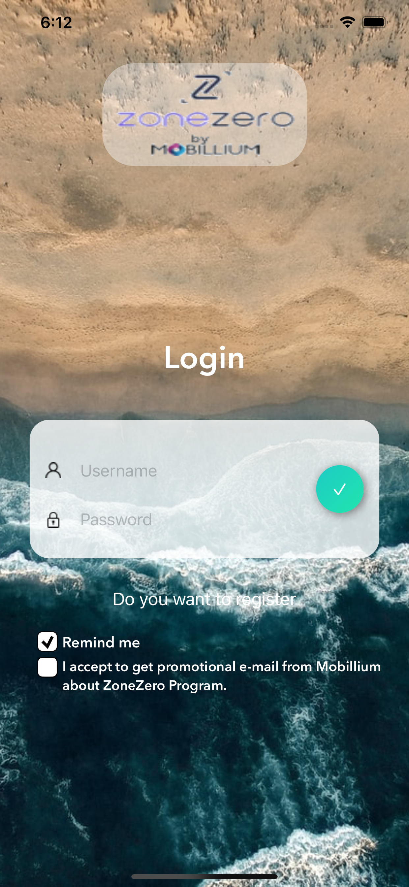
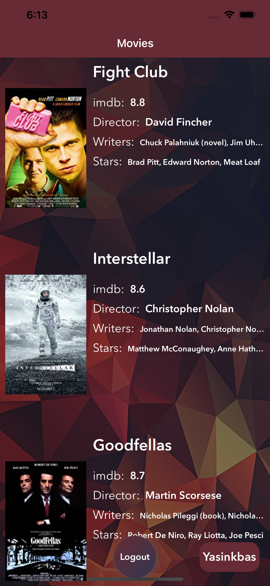

# ZoneZero Case 
Some specifications for this case
- **Architecture**: Tried to write on Vip `Clean Swift` architecture
- **Design-code**: Did not used interface builder, it means there is no xib/storyboard
- **No third-party modules**: `UILab` is written by me it is a group of extensions to write constraints more easily it is amateurish but working :) and `Then` is very simple extension.   see also for more detail
**Then**: https://github.com/devxoul/Then
- **UI**: There was no ui design in the document so i was inspired by some google searches as much as possible. Some case tasks are handled differently.
- **Time**: It was built in 3.5 days, so i know there are a lot of places that require code refactors. I tried to do my best.
- **This project made with &#9829;**
- **Thanks**

### Screenshots

